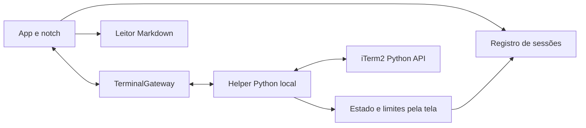

# Arquitetura do NotchControl

Aplicativo nativo macOS 15+, organizado em módulos SwiftPM e um helper Python local. O fluxo atual mostra estados no notch, abre sessões no iTerm2 e lê Markdown em um painel separado. A integração completa ainda está em desenvolvimento.

## Componentes

| Componente | Responsabilidade |
|---|---|
| `NotchControl` | Coordenação em `AppStore`, janelas AppKit, menus, preferências, localização e efeitos |
| `NotchControlCore` | Registro e identidade de sessões, estados, geometria, arquivos, parser de retomada e alertas |
| `NotchControlUI` | Gateway, tokens, componentes de notch, leitor Markdown e renderer de terminal experimental |
| `NotchControlProof` | Harness nativo para exercitar a integração sem mudar o fluxo do produto |
| `helper/` | API oficial iTerm2, descoberta de processos, classificação da tela, limites e hooks |
| `scripts/` | Preparação do ambiente, build, execução, diagnóstico e configuração reversível |

O núcleo não depende de AppKit. A aplicação decide ações e efeitos; o helper adapta o protocolo externo. Processos dos agentes pertencem ao iTerm2 e continuam vivos ao fechar o app.

## Transporte e recuperação

O app inicia o helper com o Python de `.venv`. O transporte principal é um socket Unix com permissão 0600 em um diretório temporário 0700. O bootstrap é enviado pelo stdout; o harness e os testes também usam pipes com o mesmo protocolo JSON Lines.

Mensagens carregam versão, conexão, request ID e identidade/geração do destino. Conexões novas exigem reconciliação antes de liberar operações. Comandos têm timeout de dez segundos. Leituras podem ser repetidas; input, resize e criação de abas com resultado incerto não são reenviados automaticamente.

O inventário é atualizado a cada três segundos e os estados são consultados aproximadamente a cada segundo. `ReconnectPolicy` aumenta a espera de dois em dois segundos até trinta, sem limite de tentativas; a abertura do iTerm2 reinicia a tentativa. Quando o iTerm2 encerra a conexão da API (ao ser fechado, por exemplo), o helper termina em vez de seguir sem iTerm2, e é essa saída que dispara a recuperação. A limpeza dessa saída ainda conversa com o iTerm2; se não terminar em 2 segundos, o helper sai à força. O app também encerra o helper quando o iTerm2 fecha, sem depender de o helper perceber a queda, e até o primeiro inventário depois de reconectar mostra todas as entradas como fechadas, porque nenhum terminal sobrou; o registro continua guardando as sessões para numeração e apelidos. Essa recuperação não encerra nem reinicia os agentes.

## Identidade e estados

Terminal, instância de processo e conversa são identidades diferentes. Cada bolinha representa uma instância interativa, identificada por terminal, provedor e geração do processo. Coincidência de projeto ou título não basta.

A descoberta usa linha de comando, PID, TTY e início do processo. Eventos estruturados precisam de uma associação única com a instância; eventos tardios, de subagentes ou com identidade ambígua são descartados.

O inventário também traz a conversa de cada instância (`conversation_id.py`). No Claude Code, a fonte é o registro por processo `~/.claude/sessions/<pid>.json`, aceito só quando `pid` e `procStart` batem com `ps -o lstart=` em `LC_ALL=C TZ=UTC`; o registro acompanha `/clear` e `/resume`. Sem ele, e nos outros CLIs, vale o ID da retomada na linha de comando. Hooks associados continuam preenchendo a conversa quando o inventário não a conhece.

No modo do arquivo de trabalho, `ReportDocument.entries` separa o `work.md` por `##`, e `WorkBoard` compõe as entradas com as sessões abertas por provedor e conversa. Cada entrada resolve para uma sessão: a aberta mais recente, a retomada da mais recente quando nenhuma está aberta, ou uma nota sem sessão. Uma sessão pode cobrir vários repositórios, então entradas que resolvem para a mesma sessão, pelo ID da sessão aberta ou pela conversa a retomar, formam um único `WorkItem`: a primeira na ordem do arquivo o representa e as demais ficam em `others`. Assim cada sessão, aberta ou fechada, é uma só bolinha. Notas não se juntam. Sessões abertas que nenhum item mostra ficam à parte, para que uma decisão pendente nunca fique escondida, inclusive uma segunda aba da mesma conversa.

`screen_status.py` lê o compositor de Claude Code, Codex e Cursor Agent. `account_usage.py` extrai somente limites reconhecidos no rodapé, e `context_usage.py`, do mesmo rodapé, o contexto ocupado pela sessão. Ausência de informação não vira sucesso, aprovação ou percentual inventado. O comportamento visual dos estados está em [status.md](status.md).

O uso pertence à conta e pode ser compartilhado por várias sessões. Mensagens de uso validam terminal/geração, IDs e percentuais entre 0 e 100. Leituras expiram em cinco minutos e não são persistidas.

## Operações de terminal

O produto chama `reveal` para trazer a aba correta do iTerm2 à frente. O gateway também mantém screen/history/input/resize para o harness e os experimentos existentes.

Input exige seleção, conexão e geração válidas; broadcast é suprimido. A restauração experimental compara identidade, layout e dimensões. Modos completos de teclado/colagem e ownership de resize por eventos ainda precisam de validação real. Splits/fullscreen não recebem resize experimental.

Retomada mantém parser e coordenação no núcleo e é acionada pela bolinha de uma entrada fechada no modo do arquivo de trabalho. A aba nova, ou uma janela nova quando o iTerm2 não tem nenhuma, roda o agente por `/bin/zsh -lic`: o zsh só lê o `.zshrc` em shell interativo, e é nele que costuma ficar o `PATH` (Homebrew etc.) que o agente e os comandos dele herdam. Sem conexão, o clique abre o iTerm2 se ele estiver fechado e guarda o pedido; a retomada roda no primeiro inventário depois de conectar, e uma sessão que o iTerm2 restaurou é selecionada em vez de duplicada. Sem conexão em 20 segundos, o pedido cai e aparece o aviso de conexão. No leitor, comandos de Markdown continuam texto. Resultado ambíguo de criação exige reconciliação antes de permitir outra tentativa: um novo clique procura a sessão no inventário e, passado o prazo de 15 segundos sem ela, libera a próxima tentativa. Falhas e avisos da retomada abrem o painel no arquivo de trabalho quando o notch está recolhido, para que o clique nunca termine em silêncio.

## Arquivos e dados locais

`ReportFileReader` lê UTF-8, estabiliza atualizações e observa substituição atômica. O leitor conserva o último conteúdo válido durante atualização ou erro; uma troca de arquivo reinicia a posição de leitura. `MarkdownRenderer` usa Foundation e AppKit, sem WebView.

- `.notchcontrol/preferences.json`: posição, pin (`alwaysVisible`) e se ele aparece no notch, visibilidade do notch, idioma, arquivos, alertas e modo do arquivo de trabalho. O pin tem prioridade sobre a visibilidade. Arquivos salvos antes da visibilidade continuam válidos: com o pin solto viram Sempre recolhido, como o notch se comportava, e os demais, Automático.
- `.notchcontrol/sessions.json`: identidade, ordem e aliases; sem títulos, estados transitórios ou números de sessão.
- `.notchcontrol/events/`: metadata sanitizada de hooks.
- `.notchcontrol/hook-plan-*.json`: plano privado de configuração, incluindo o conteúdo anterior necessário para detectar concorrência.
- `.proof/`: ambiente e códigos de diagnóstico.

A tela é usada em memória para classificação e apresentação experimental. Diagnósticos não arquivam prompts, transcrições, credenciais ou decisões de aprovação. Arquivos de estado e planos são privados e ignorados pelo Git.

Hooks preservam integrações de terceiros. Aplicação e remoção exigem que o arquivo atual corresponda ao plano preparado; configurações concorrentes ou links simbólicos são recusados. A confiança é concedida pelo fluxo oficial do CLI.

## Donos dos componentes nativos

| Capability | Canonical owner | Source of truth | Allowed variants | Verification |
|---|---|---|---|---|
| Tokens | `DesignTokens` gerado | `DESIGN.md` | Escuro nativo | `generate-design.py --check` |
| Select/Listbox | Pickers SwiftUI/AppKit em `SettingsView` | Controles nativos | Idioma, borda, monitor e som | Teclado/popup real pendentes |
| Form | `SettingsView` e `AppStore` | Preferências e ações do app | Configuração revisável | Testes de configuração e build |
| Scrollbar | `NSScrollView` e `ScrollView` | Layout nativo | Notch em overflow e leitor | Testes de apresentação; janela real pendente |
| Toast | `noticeKey` e notificações de sistema | Catálogos e `AlertTracker` | Feedback persistente e eventos deduplicados | `AlertTests`; sistema real pendente |
| Janelas | `WindowCoordinator`, `PanelLayout` e `RailDrag` | Geometria do núcleo | Não modal; ambas as bordas | Testes de geometria/arraste; Spaces pendente |
| Markdown | `ReportPanel`, `ReportReader` e `MarkdownReader` | Leitor somente leitura | Trabalho e histórico | Testes de arquivos e renderização |
| Terminal experimental | `TerminalGateway` e `TerminalCanvas` | Protocolo local | Harness da integração | Fixtures; modos/input reais pendentes |

Painel e notch usam janelas distintas coordenadas; o notch acompanha a borda interna durante abertura e fechamento. Hover e alertas não capturam foco. Movimento reduzido desativa transições. PT-BR e inglês compartilham os mesmos componentes e catálogos.

## Validação e trabalho pendente

`scripts/test.sh` cobre o núcleo, componentes nativos, subprocessos e arquivos temporários. Fixtures e tipos do SDK instalado não comprovam a conexão completa com sessões reais.

Descoberta e leitura de estados já foram exercitadas com iTerm2 3.7.3 e CLIs locais. Permanecem pendentes a associação completa dos hooks, os modos experimentais de terminal, VoiceOver, Spaces, cenários com vários monitores e execução Intel. `watch_status` ainda precisa de isolamento/timeout por sessão para que uma leitura travada não bloqueie o conjunto.

A documentação pública de instalação, diagnóstico e limitações está no [README](../README.md). Novas integrações devem demonstrar identidade e comportamento observável antes de ampliar o suporte anunciado.
